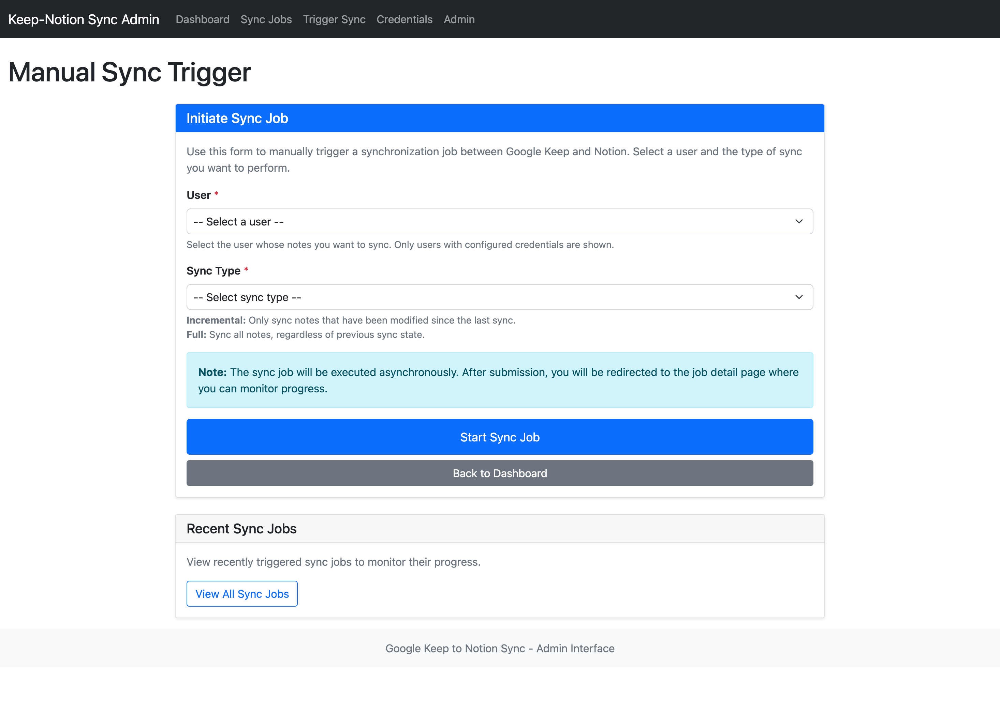
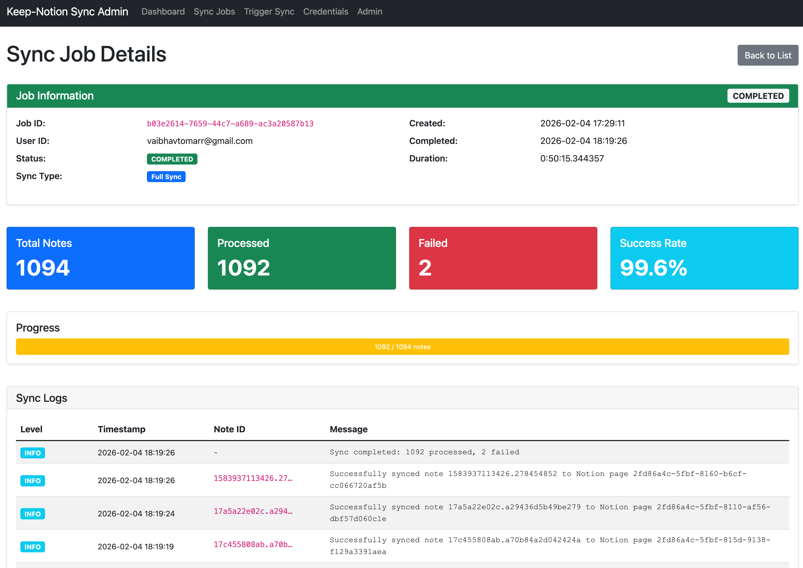
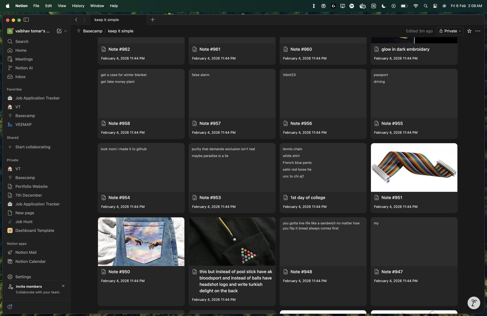

# Keep2Notion

> Automatically sync your Google Keep notes to Notion with images, labels, and full content preservation.

[](https://opensource.org/licenses/MIT)
[](https://www.python.org/downloads/)
[](https://www.docker.com/)
[](CONTRIBUTING.md)

---
##  Features

-  **Automatic Sync**: Keep your notes synchronized between Google Keep and Notion
-  **Image Support**: Automatically uploads images to S3 and embeds them in Notion
-  **Label Preservation**: Keep labels are synced as Notion tags
-  **Admin Dashboard**: Web-based interface to monitor and manage syncs
-  **Secure**: All credentials encrypted at rest using AES-256
-  **Docker Ready**: Easy deployment with Docker Compose
-  **Cloud Native**: Kubernetes manifests included for production deployment
-  **Monitoring**: Built-in health checks and detailed sync logs
-  **Incremental Sync**: Only syncs changed notes to save time and resources

---

##  Screenshots

### Manual Sync Trigger
Easily trigger synchronization jobs from the admin interface with options for full or incremental sync.



### Sync Job Details
Monitor sync progress in real-time with detailed logs, success rates, and comprehensive job information.



### Notion Database preview
With gallery view, access and navigate through all of your google keep notes in Notion as you would have in Keep



---

##  Architecture

```
┌─────────────┐     ┌──────────────┐     ┌─────────────┐
│ Google Keep │────▶│ Keep         │────▶│   AWS S3    │
│             │     │ Extractor    │     │  (Images)   │
└─────────────┘     └──────────────┘     └─────────────┘
                            │
                            ▼
                    ┌──────────────┐
                    │    Sync      │
                    │ Orchestrator │
                    └──────────────┘
                            │
                            ▼
                    ┌──────────────┐     ┌─────────────┐
                    │   Notion     │────▶│   Notion    │
                    │   Writer     │     │  Database   │
                    └──────────────┘     └─────────────┘
                            │
                            ▼
                    ┌──────────────┐
                    │  PostgreSQL  │
                    │  (Sync State)│
                    └──────────────┘
                            │
                            ▼
                    ┌──────────────┐
                    │    Admin     │
                    │  Interface   │
                    └──────────────┘
```

See [ARCHITECTURE.md](ARCHITECTURE.md) for detailed architecture documentation.

---

##  Quick Start

### Prerequisites

- Docker & Docker Compose
- AWS Account (for S3 storage)
- Google Account (for Keep)
- Notion Account with API access

### Installation

1. **Clone the repository**
   ```bash
   git clone https://github.com/cochilocovt/keep2notion.git
   cd keep2notion
   ```

2. **Copy environment template**
   ```bash
   cp .env.example .env
   ```

3. **Configure environment variables**
   
   Edit `.env` and fill in your credentials:
   ```bash
   # Database
   DATABASE_URL=postgresql://postgres:postgres@db:5432/keep_notion_sync
   
   # AWS S3
   AWS_REGION=us-east-1
   AWS_S3_BUCKET=your-bucket-name
   AWS_ACCESS_KEY_ID=your-access-key
   AWS_SECRET_ACCESS_KEY=your-secret-key
   
   # Encryption
   ENCRYPTION_KEY=your-32-byte-base64-key
   SECRET_KEY=your-django-secret-key
   ```

4. **Generate encryption keys**
   ```bash
   # Generate encryption key
   python -c "import base64, os; print(base64.urlsafe_b64encode(os.urandom(32)).decode())"
   
   # Generate Django secret key
   python -c "from django.core.management.utils import get_random_secret_key; print(get_random_secret_key())"
   ```

5. **Start the services**
   ```bash
   docker-compose up -d
   ```

6. **Access the admin interface**
   
   Open http://localhost:8000 in your browser

7. **Configure credentials**
   
   - Navigate to "Credential Configuration"
   - Add your Google Keep master token
   - Add your Notion API token and database ID
   - Save

8. **Trigger your first sync**
   
   - Go to "Manual Sync Trigger"
   - Select your user
   - Choose "Full Sync"
   - Click "Start Sync"

---

## 🔑 Getting Credentials

### Google Keep Master Token

Google Keep doesn't have an official API. Follow these steps:

1. Install dependencies:
   ```bash
   pip install gpsoauth
   ```

2. Run the token generator:
   ```bash
   python get_master_token_python.py
   ```

3. Follow the prompts to get your master token

### Notion API Token

1. Go to https://www.notion.so/my-integrations
2. Click "New integration"
3. Give it a name (e.g., "Keep2Notion")
4. Select capabilities: Read content, Update content, Insert content
5. Copy the "Internal Integration Token"
6. Share your target database with the integration

### Notion Database ID

1. Open your Notion database in a browser
2. The database ID is in the URL:
   ```
   https://notion.so/workspace/DATABASE_ID?v=...
   ```
3. Copy the 32-character DATABASE_ID

---

## 📖 Documentation

- [Architecture](ARCHITECTURE.md) - System design and components
- [Monitoring Guide](MONITORING_GUIDE.md) - How to monitor the application
- [Sync State Management](SYNC_STATE_MANAGEMENT.md) - Understanding sync state
- [Deployment Guide](deployment/README.md) - Production deployment
- [Roadmap](ROADMAP.md) - Planned features

---

##  Docker Deployment

### Development

```bash
docker-compose up -d
```

### Production

See [deployment/README.md](deployment/README.md) for production deployment guides:
- AWS EKS deployment
- Kubernetes configuration
- Terraform infrastructure
- Security best practices

---

##  Testing

```bash
# Install test dependencies
pip install pytest pytest-cov

# Run tests
pytest

# With coverage
pytest --cov=. --cov-report=html
```

---

##  Contributing

We welcome contributions! Please see [CONTRIBUTING.md](CONTRIBUTING.md) for details.

---

##  License

This project is licensed under the MIT License - see the [LICENSE](LICENSE) file for details.

---

##  Acknowledgments

- [gkeepapi](https://github.com/kiwiz/gkeepapi) - Unofficial Google Keep API
- [notion-sdk-py](https://github.com/ramnes/notion-sdk-py) - Notion Python SDK
- [FastAPI](https://fastapi.tiangolo.com/) - Modern web framework
- [Django](https://www.djangoproject.com/) - Admin interface framework

---

## ⚠️ Important Notes

- **Google Keep API**: This project uses an unofficial Google Keep API. Google may change their API at any time, which could break functionality.
- **Security**: Always keep your `.env` file secure and never commit it to version control.
- **AWS Costs**: S3 storage and data transfer may incur costs. Monitor your AWS usage.
- **Rate Limits**: Notion API has rate limits (3 requests/second). Large syncs may take time.

---

<p align="center">
  Made with ❤️ for the productivity community
</p>
